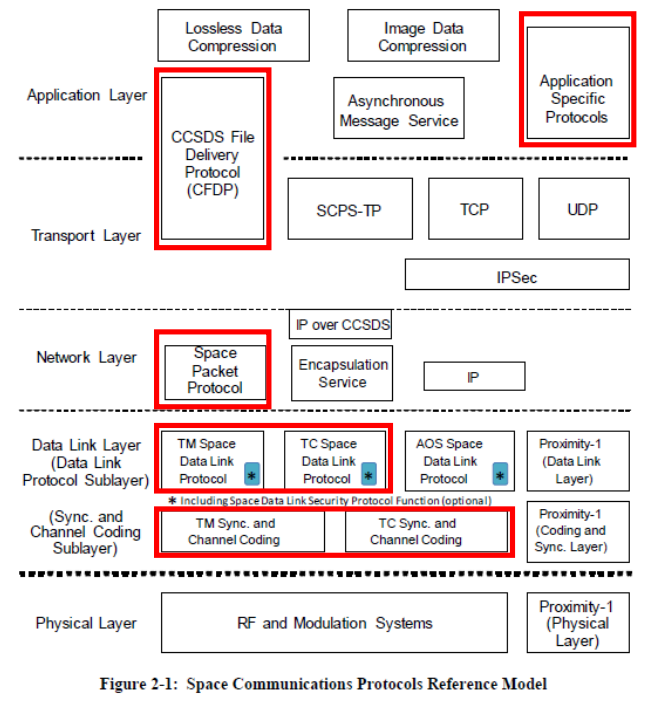
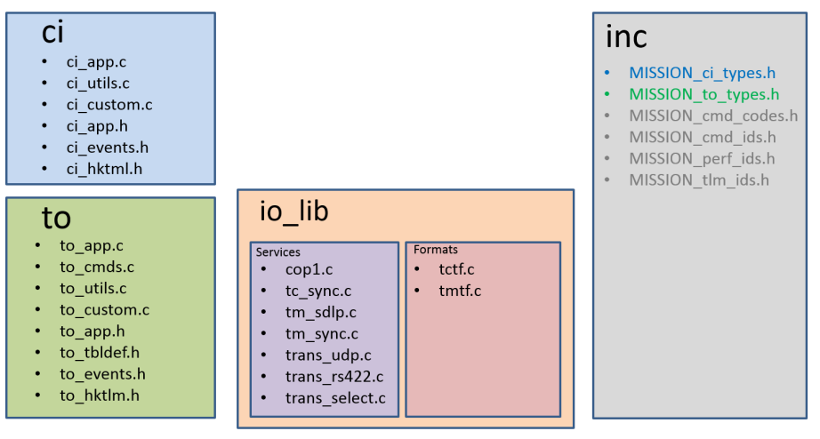
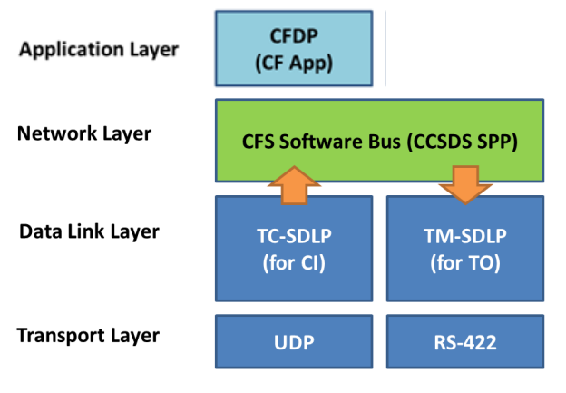

# Introduction

The **Telemetry Output (TO)** is a [cFS](https://github.com/nasa-itc/cFE/tree/79c22d9edfe425f39efc782bb168aefe8db5ddf7) application used for sending telemetry to the ground station (GS). 

Within the NOS3 project repository, the TO directory can be found at `./fsw/apps/to`. This directory is a submodule for the dedicated [TO repository](https://github.com/nasa-itc/CFS_TO/tree/db65b4381160adbbd35b8b140b2e5a19cfab1c5a). This repository contains a very detailed, 72-page PDF documenting the architecture in the `docs` directory, which is the source for most of the information on this page. 

Note: you may also observe a directory called `to_lab`. This is the "laboratory" version of the TO app, where commands are sent over a non-blocking UDP socket.

# cFS Telemetry Output App

The TO app uses the Telemetry Space Data Link Protocol (TM-SDLP) to send telemetry from the spacecraft to the GS. These messages are picked up by the cFE Software Bus (SB) module, which implements Space Packet Protocol (SPP) services. A cFS application, such as TO, is a direct implementation of the CCSDS File Delivery Protocol (CFDP). In contrast to TM-SDLP, TC-SDLP is used for sending commands from the GS to a spacecraft. 

Both data link protocols provide three link identifiers used to identify data streams:
- Transfer Frame Version Number (TFVN) - distinguishes between Transfer Frames (TFs), which are the equivalent of Protocol Datagram Units in the TCP/IP model
- Spacecraft Identifier (SCID)
- Virtual Channel Identifier (VCID) - Virtual Channels (VCs) allow the use of a single physical channel to relay data among higher-layer data streams. 

Mission-specific customization is stored in the file `to_custom.c`. All protocols are provided through a CFS libraries called the IO_LIB. The libraries are divided into services and formats; services include protocol and transport services; format includes header manipulation APIs and transfer frame protocols (TCTF, TMTF) for the IO_LIB. 

The IO_LIB files are stored in `./fsw/apps/io_lib`. The headers for the TO app are in `./fsw/apps/to/fsw/mission_inc`.

The file structure can be seen below:

# Introduction

The *Telemetry Output (TO)** ais a [cFS](https://github.com/nasa-itc/cFE/tree/79c22d9edfe425f39efc782bb168aefe8db5ddf7) application used for sending telemetry to the ground station (GS). 

Within the NOS3 project repository, the TO directory can be found at `./fsw/apps/to`. This directory is a submodule for the dedicated [TO repository](https://github.com/nasa-itc/CFS_TO/tree/db65b4381160adbbd35b8b140b2e5a19cfab1c5a). This repository contains a very detailed, 72-page PDF documenting the architecture in the `docs` directory, which is the source for most of the information on this page. 

Note: you may also observe a directory called `to_lab`. This is the "laboratory" version of the TO app, where commands are sent over a non-blocking UDP socket.

# cFS Telemetry Output App

The TO app uses the Telemetry Space Data Link Protocol (TM-SDLP) to send telemetry from the spacecraft to the GS. These messages are picked up by the cFE Software Bus (SB) module, which implements Space Packet Protocol (SPP) services. A cFS application, such as TO, is a direct implementation of the CCSDS File Delivery Protocol (CFDP). In contrast to TM-SDLP, TC-SDLP is used for sending commands from the GS to a spacecraft. 

Both data link protocols provide three link identifiers used to identify data streams:
- Transfer Frame Version Number (TFVN) - distinguishes between Transfer Frames (TFs), which are the equivalent of Protocol Datagram Units in the TCP/IP model
- Spacecraft Identifier (SCID)
- Virtual Channel Identifier (VCID) - Virtual Channels (VCs) allow the use of a single physical channel to relay data among higher-layer data streams. 

Mission-specific customization is stored in the file `to_custom.c`. All protocols are provided through a CFS libraries called the IO_LIB. The libraries are divided into services and formats; services include protocol and transport services; format includes header manipulation APIs and transfer frame protocols (TCTF, TMTF) for the IO_LIB. 

## Reference Model

The data link and transport layer services are accessed through IO libraries, while the CFDP services are implemented by the CF application. 

The IO_LIB files are stored in `./fsw/apps/io_lib`. The headers for the TO app are in `./fsw/apps/to/fsw/mission_inc`.

The file structure can be seen below:

Within the TO directory (and all other cFS apps) the following files can be found. Note that some of the files described to not appear to be used in the NOS3 implementation:
- `to_app.c`: Generic app source code that calls functions from `to_custom.c`. Implements the generic cFS application pattern for interactions with the cFE core services (SB, table services)
- `to_utils.c`: Holds the definition of utility functions used by other functions; prototypes are defined in `to_app.h`
- `to_custom.c`: Mission-specific code and generic API called by `to_app.c` functions
- `to_app.h`: Holds the app's data structure and public generic function prototypes, including required custom functions called from `to_app.c` and defined in `to_custom.c`
- `to_events.h`: Defines the event numbers for the application
- `to_hktlm.h`: Presents a standard housekeeping packet, included through the `MISSION_to_types.h` file. If a custom packet structure is desired, the `#include` is removed and the custom structure is defined in the `MISSION_to_types.h` file

The following files are unique to the TO app:
- `to_cmds.c`: Holds the definition and local prototypes of the response to generic TO app commands
- `to_tbldefs.h`: Defines the TO configuration table for message subscription and routing
- `to_cmds.h`: Describes the prototype and message structures of standard TO commands
- `to_platform_cfg.h`: Holds all configuration definitions, such as transport protocol, buffer size, pipe depths
- `to_mission_cfg.`: Includes all mission specific configuration files defined in `apps/inc` 

Quick note: it is currently unclear to me whether the `apps/inc` folder is really used in NOS3. It does not appear to be present, and files referenced in the TO documentation (e.g. `MISSION_to_types.h`) are only present in the TO examples directory. 

This `apps/inc` folder contains files containing structures and macro definitions used by TO for a specific mission.
- `MISSION_to_types.h`: Contains the definition of custom command/telemetry message structures
`MISSION_cmd_ids.h`: Includes the definition of all command message IDs (which must be unique)
- `MISSION_cmd_codes.h`: Includes the definition of all command code IDs (specific to each app, and can be reused between apps)
- `MISSION_tlm_ids.h`: Includes the definition of all telemetry message IDs (must be unique)
- `MISSION_perf_ids.h`: Includes the definition of all performance monitoring IDs (must be unique)

# Concept of Execution
- **Command Ingest (CI)**: receives commands from external source over transport channel and forwards the command to the appropriate application over the cFE SB. 
  - **Gate command**: Special CI command that allows the CI app to respond to critical commands used for IO control. Message ID is `CI_GATE_CMD_MID`. Commands with this ID are processed immediately when received, and not sent to the SB.
  - **Uplink data flow**: Follows this sequence:
    1. CI custom task pends on receipt of a new packet through API calls to the IO_LIB service transport protocols (UDP or RS422)
    2. Once received, CI custom task calls the necessary service APIs to manipulate the received data
    3. On reception of a `CI_GATE_CMD_MID` message, the appropriate command is executed based on the command code in the message
    4. Any other messages are forwarded to software bus for use by other applications

- **Telemetry output**: Transmits telemetry to external destinations; configuration table determines message routing - route-specific telemetry pipes are subscribed to specified messages, which are processed through route-specific protocol stacks when received from the SB
  - Route is defined as a particular set of operations to execute on specified data before being sent over the transport channel (aka protocol stack). This can be a sequence of IO_LIB format/service calls, or custom data manipulation
    - The route for a packet is determined by its message ID as specified in the TO configuration table through the `usRouteMask` parameter. Specific operations related to the route are implemented by the user in the custom segment of the TO applications.
    - Each route has a separate SB telemetry pipe that is subscribed to all messages routed to that pipe according to the configuration table
  - **Downlink data flow**
    1. Each telemetry pipe receives messages it is subscribed to, according to the configuration table
    2.TO task is woken up by the scheduler via the WAKEUP message (or through a timeout) which causes it to read its telemetry pipes
    3. For each pipe of enabled routes, all new messages containing a valid message ID are processed according to the associated route.
    4. Message is sent over the appropriate IO transport channel for the downlink

# Interface
The CI application has two tasks: the main task, which processes CI commands, and the child task that processes incoming uplink commands. 

The TO application's only task, which is scheduled by a WAKEUP message through the SB or a timeout, is responsible for processing route-specific messages to downlink destinations

The TO app is conceptually split into two layers - though the distinction is only the fact that they are defined in different files. They are the application layer (`to_app.c`) and the custom layer (`to_custom.c`).

The application layer functions are described below.

| Function | Description | 
| - | - |
| `TO_AppInit` | Initializes the app by calling all other `Init` functions |
| `TO_InitEvent` | Initializes TO events with cFE Event services | 
| `TO_InitPipe` | Initializes the schedule, command, and telemetry pipes, and subscribes each pipe to the appropriate messages | 
| `TO_InitData` | Initializes the housekeeping packet | 
| `TO_InitTable` | Registers the configuration table with Table services | 
| `TO_ValidateTable` | Validate the configuration table | 
| `TO_RcvMsg` | Blocks on the schedule pipe, processes new application commands, and processes telemetry on a Wakeup message | 
| `TO_ProcessNewCmds` | Polls command pipe for new application commands and calls `TO_ProcessNewAppCmds` from `to_cmds.c`. Also calls `TO_ReportHousekeeping` upon receiving a `SEND_HK` message |
| `TO_ProcessTlmPipes` | Loop over all existing telemetry pipes and call `TO_ProcessNewData` if current wakeup count corresponds to route's wake period |
| `TO_ProcessNewData` | Polls telemetry pipe for any new telemetry and calls `TO_CustomProcessData` from `to_custom.c` |
| `TO_ReportHousekeeping` | Sends housekeeping packet to SB |
| `TO_AppMain` | Calls `TO_AppInit` then loops on `TO_RcvMsg`; calls `TO_CustomCleanup` before exiting |

### Application Commands

The following commands are processed through `TO_ProcessNewAppCmds`, defined in `to_cmds.c`. The command codes correspond to the application command message `TO_APP_CMD_MID` - any other command code is assumed to be a custom command handled by `TO_CustomAppCmds`.

| Command Code            | Description                                                            |
|-------------------------|------------------------------------------------------------------------|
| `TO_APP_NOOP_CC`        | No-operation command. Increment command counter.                       |
| `TO_APP_RESET_CC`       | Reset the housekeeping packet.                                         |
| `TO_ENABLE_OUTPUT_CC`   | Call the TO_CustomEnableOutputCmd to configure and enable routes. Sets `usOutputEnabled` and `usOutputActive` to true. |
| `TO_DISABLE_OUTPUT_CC`  | Call the TO_CustomDisableOutputCmd to disable output of specific route(s). Sets `usOutputEnabled` to false. |
| `TO_ACTIVATE_ROUTES_CC` | Enable all routes by supplied `usRouteMask`. A route must be configured to be enabled. |
| `TO_DEACTIVATE_ROUTES_CC` | Disable all routes by supplied `usRouteMask`.                         |
| `TO_PAUSE_OUTPUT_CC`    | Pause transmission of all downlink (set `usOutputActive` to false).    |
| `TO_RESUME_OUTPUT_CC`   | Resume transmission of all downlink (set `usOutputActive` to true).    |
| `TO_ADD_TBL_ENTRY_CC`   | Add an entry to the config table.                                      |
| `TO_REMOVE_TBL_ENTRY_CC`| Remove a table entry by message id.                                    |
| `TO_ENABLE_MSG_CC`      | Enable a table entry in the config table by MID.                       |
| `TO_DISABLE_MSG_CC`     | Disable a table entry in the config table by MID.                      |
| `TO_ENABLE_GROUP_CC`    | Enable a group in the config table.                                    |
| `TO_DISABLE_GROUP_CC`   | Disable a group in the config table.                                   |
| `TO_ENABLE_ALL_CC`      | Enable all used table entries.                                         |
| `TO_DISABLE_ALL_CC`     | Disable all used table entries.                                        |
| `TO_SET_ROUTE_BY_MID_CC`| Set the `usRouteMask` of a table entry by MID.                         |
| `TO_SET_ROUTE_BY_GROUP_CC`| Set the `usRouteMask` of multi entries by `uiGroupData`.               |
| `TO_MANAGE_TABLE_CC`    | Hook for cFE Table services.                                           |
| `TO_SET_ROUTE_PERIOD_CC`| Set the `wakePeriod` value for routes. Value must be a factor of `TO_MAX_WAKEUP_COUNT`. |

